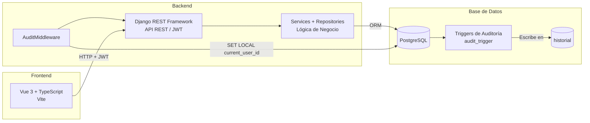

# 🕐 KairOs — Sistema de Monitoreo de Equipos Universitarios


**KairOs** es una plataforma integral de gestión de activos tecnológicos para laboratorios de cómputo universitarios. Desarrollada bajo un enfoque de **IT Asset Management (ITAM)**, centraliza el control de espacios físicos, equipos, software, mantenimiento e incidencias — asegurando que cada recurso esté disponible en el momento preciso y con trazabilidad completa de cada acción realizada.

---

## ✨ Características Principales

- 📦 **Gestión de Activos**: Control completo de equipos y sus componentes, con seguimiento de estado en tiempo real.
- 🧩 **Inventario de Software**: Catálogo de productos, licencias e instalaciones por equipo con validación de disponibilidad.
- 🔧 **Tickets de Mantenimiento**: Creación y cierre de órdenes de trabajo con asignación de técnicos especializados.
- 🚨 **Gestión de Incidencias**: Flujo de atención estructurado con máquina de estados y escalamiento a mantenimiento.
- 🛡️ **Auditoría Automática**: Cada acción sobre las entidades del sistema queda registrada en `historial` mediante triggers nativos de PostgreSQL — sin intervención de la aplicación.
- 🔐 **Autenticación JWT**: Tokens con claims personalizados (`nombre`, `rol`, `id_tecnico`) y blacklist de refresh tokens.

---

## 🏗️ Arquitectura General

El sistema está compuesto por dos aplicaciones independientes que se comunican a través de una API REST:



---

## 📂 Estructura del Repositorio

```bash
KairOs/
├── backend/    # API REST — Django + DRF + PostgreSQL
└── frontend/   # SPA — Vue 3 + TypeScript + Vite
```

Cada subcarpeta tiene su propio README con instrucciones detalladas de instalación, endpoints y solución de errores.

---

## 🛠️ Stack Tecnológico

| Capa | Tecnología |
|------|------------|
| Frontend | Vue 3, TypeScript, Vite |
| Backend | Python 3.14, Django 5.2, Django REST Framework 3.17 |
| Base de datos | PostgreSQL 16 |
| Autenticación | JWT — djangorestframework-simplejwt |
| Auditoría | Triggers nativos de PostgreSQL |
| Documentación API | drf-spectacular (Swagger / OpenAPI) |

---

## 🚀 Inicio Rápido

### Backend
```bash
cd backend
python -m venv env && source env/bin/activate
pip install -r requirements.txt
cp .env.example .env        # completar variables
psql -U postgres -c "CREATE DATABASE kairos_db;"
psql -U postgres -d kairos_db -f database/bd.sql
python manage.py makemigrations
python manage.py migrate --fake-initial
python manage.py createsuperuser
python manage.py runserver
```

### Frontend
```bash
cd frontend
npm install
npm run dev
```

> Para instrucciones completas, errores frecuentes y referencia de endpoints consulta el [README del backend](./backend/README.md).

---

## 📡 API

La API estará disponible en `http://localhost:8000/api/v1/` una vez levantado el backend.
Documentación interactiva Swagger: `http://localhost:8000/api/schema/swagger-ui/`

### Módulos disponibles

| Módulo | Ruta base |
|--------|-----------|
| Autenticación | `api/v1/usuarios/auth/` |
| Usuarios | `api/v1/usuarios/` |
| Espacios | `api/v1/espacios/` |
| Equipos | `api/v1/equipos/` |
| Software | `api/v1/software/` |
| Mantenimiento | `api/v1/mantenimiento/` |
| Incidencias | `api/v1/incidencias/` |
| Historial | `api/v1/historial/` |
