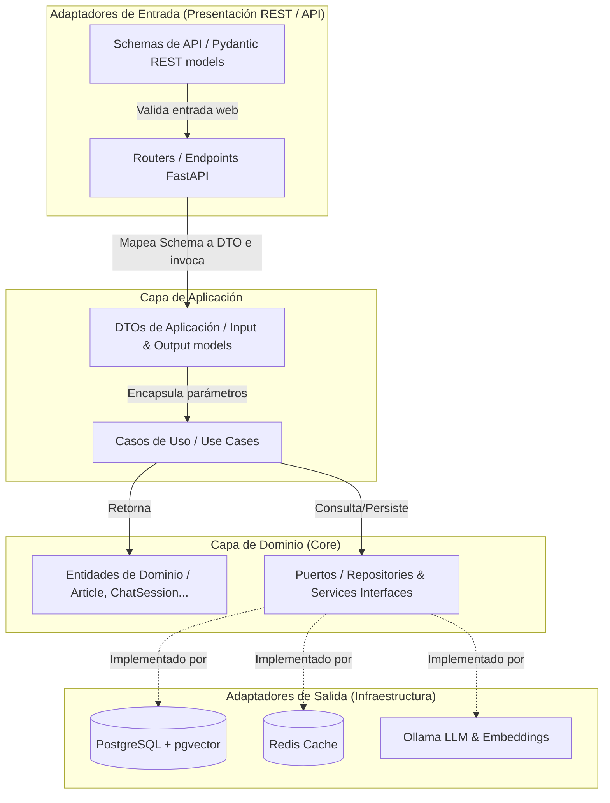

# 🚀 Backend API — Servidor de Noticias IA


Este es el núcleo inteligente del Portal de Noticias de Huánuco. Un backend robusto desarrollado en **FastAPI** que orquesta la ingesta de noticias, el almacenamiento vectorial y la inferencia de IA local para ofrecer una experiencia RAG (Retrieval-Augmented Generation) fluida.

---

## ✨ Características Principales

- 🧠 **RAG Nativo**: Procesamiento de lenguaje natural sobre noticias locales utilizando Ollama.
- 🔍 **Búsqueda Híbrida**: Combinación de búsqueda vectorial (semántica) y palabras clave exactas.
- ⚡ **Streaming SSE**: Respuestas de IA en tiempo real mediante Server-Sent Events.
- 🔄 **Sincronización Automática**: Scrapers especializados para WordPress y sitios locales.
- 🛡️ **Arquitectura Hexagonal**: Código desacoplado, modular y altamente testeable basado en puertos y adaptadores.
- 🚀 **Caché Proactiva**: Integración con Redis para optimizar tiempos de respuesta.

---

## 🏗️ Arquitectura de Software: Hexagonal (Puertos y Adaptadores)

El backend implementa una **Arquitectura Hexagonal (Puertos y Adaptadores)** estricta, lo que garantiza el desacoplamiento completo de la lógica de negocio central (Dominio y Aplicación) frente a la infraestructura técnica y del protocolo HTTP.



---

## 🛠️ Tecnologías Utilizadas

### Core & API
- **FastAPI**: Framework web asíncrono de alto rendimiento.
- **SQLAlchemy**: ORM para gestión de base de datos relacional.
- **Pydantic**: Validación de datos y gestión de esquemas.

### Inteligencia Artificial
- **Ollama**: Motor de inferencia local para LLMs (`qwen2.5-coder:1.5b`) y embeddings (`embeddinggemma`).
- **pgvector**: Extensión de PostgreSQL para almacenamiento y búsqueda de vectores.

### Infraestructura
- **PostgreSQL**: Base de datos principal.
- **Redis**: Capa de caché y gestión de estado.
- **Docker & Docker Compose**: Contenedorización completa del entorno.

---

## 🧠 Integración de IA Local

El backend se comunica con una instancia local de Ollama:
- **Embeddings**: Vectorización de títulos y contenido (768 dimensiones).
- **Chat**: Generación de respuestas contextuales con inyección de noticias relevantes.

---

## 🚀 Instalación y Uso

### Requisitos Previos
- Docker y Docker Compose.
- Ollama instalado localmente (con los modelos `qwen2.5-coder:1.5b` y `embeddinggemma`).

### Configuración
1. Copia el archivo de ejemplo de variables de entorno:
   ```bash
   cp .env.example .env
   ```
2. Ajusta las variables según tu entorno local.

### Ejecución con Docker
```bash
docker compose up --build
```

El servidor estará disponible en `http://localhost:8000`. Puedes acceder a la documentación interactiva en `http://localhost:8000/docs`.

---

## 📂 Estructura del Proyecto

```bash
backend/app/
├── main.py             # Punto de entrada de FastAPI.
├── api/                # Adaptadores de entrada (HTTP endpoints & schemas).
├── application/        # Casos de uso de la aplicación (Lógica de negocio).
├── domain/             # Dominio puro (Entidades y puertos/interfaces).
└── infrastructure/     # Adaptadores de salida (Base de datos, Caché, IA y Scrapers).
```
