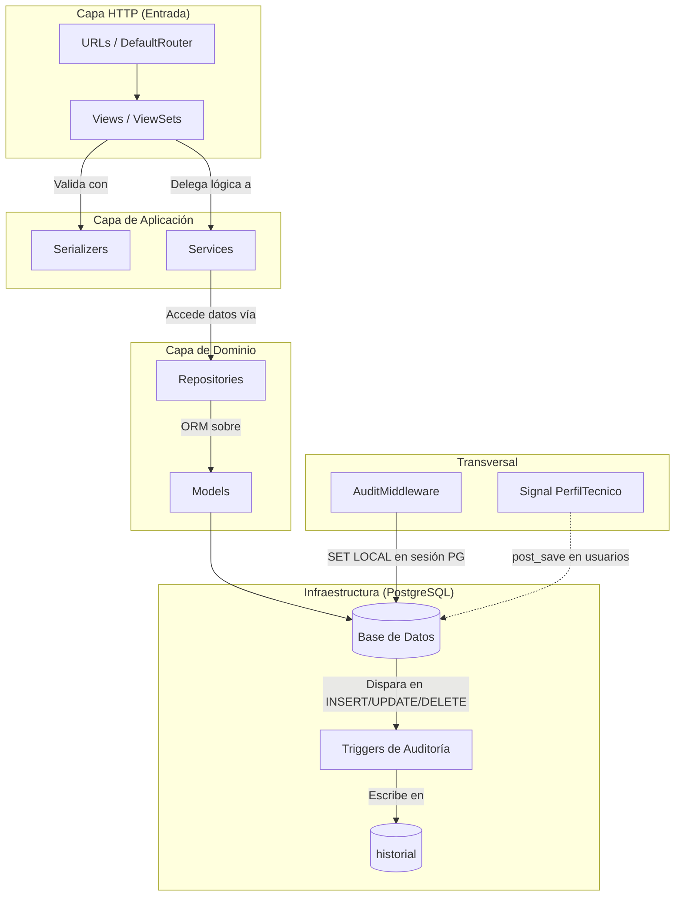

# 🖥️ KairOs — Backend API


Este es el núcleo del Sistema de Monitoreo de Equipos Universitarios **KairOs**. Un backend construido con **Django REST Framework** que centraliza la gestión de espacios físicos, equipos tecnológicos, software, mantenimiento e incidencias — todo respaldado por una capa de auditoría automática implementada directamente en **PostgreSQL mediante triggers**, sin intervención de Django.

---

## ✨ Características Principales

- 🔐 **JWT Manual con Claims Personalizados**: Login propio con `nombre`, `rol` e `id_tecnico` embebidos en el token, sin depender de los endpoints por defecto de SimpleJWT.
- 🏗️ **Arquitectura en Capas SOLID**: Cada módulo separa estrictamente Model → Repository → Service → Serializer → View → URL.
- 🛡️ **Auditoría Automática por Triggers**: La tabla `historial` es creada y poblada exclusivamente por PostgreSQL. Django solo la lee — nunca escribe en ella.
- 🔄 **Máquina de Estados para Incidencias**: Transiciones controladas `pendiente → en_revision → resuelta → cerrada` con validación explícita de cada paso.
- 🧩 **BaseRepository Genérico**: Repositorio base con tipos genéricos `BaseRepository[T]` que estandariza el acceso a datos en todos los módulos (excepto `historial`, por diseño ISP).
- 🧑‍💻 **Middleware de Auditoría Global**: `AuditMiddleware` inyecta `app.current_user_id` y `app.ip_address` en la sesión PostgreSQL antes de cada request, para que los triggers lean el contexto del usuario activo.
- ⚙️ **Signal para Perfil Técnico**: Se usa Django Signal únicamente en `usuarios` para crear `PerfilTecnico` automáticamente cuando un usuario recibe `rol=tecnico`.

---

## 🏗️ Arquitectura de Software

El backend aplica una **arquitectura en capas** estricta con principios SOLID en cada módulo. La dependencia siempre fluye hacia adentro: las vistas no conocen los repositorios, los servicios no conocen HTTP.



---

## 🛠️ Tecnologías Utilizadas

### Core & API
- **Django 5.2** — Framework principal.
- **Django REST Framework 3.17** — Construcción de la API REST.
- **djangorestframework-simplejwt** — Base para manejo de tokens JWT (usado manualmente).
- **django-filter** — Filtrado declarativo de querysets.

### Base de Datos & ORM
- **PostgreSQL 16** — Base de datos principal con tipos ENUM, índices y triggers nativos.
- **psycopg2-binary** — Conector Python ↔ PostgreSQL.

### Utilidades de Desarrollo
- **drf-spectacular** — Documentación automática Swagger / OpenAPI en `/api/schema/swagger-ui/`.
- **django-debug-toolbar** — Inspección de queries SQL en modo DEBUG.
- **django-extensions** — Comandos extra (`shell_plus`, `show_urls`).
- **python-dotenv** — Variables de entorno desde `.env`.

### Testing
- **pytest-django** — Suite de tests con pytest.
- **model-bakery** — Generación de fixtures realistas para tests.

---

## 📦 Módulos

| Módulo | Descripción |
|--------|-------------|
| `usuarios` | Usuarios con `AbstractBaseUser`, JWT manual, Signal para PerfilTecnico |
| `espacios` | Pabellones y espacios físicos de la universidad |
| `equipos` | Equipos y componentes. Endpoint dedicado `PATCH /equipos/{id}/estado/` |
| `software` | Productos de software e instalaciones por equipo. Valida licencias disponibles |
| `mantenimiento` | Tickets de mantenimiento con asignación de técnicos. Cambia estado del equipo al abrir/cerrar |
| `incidencias` | Reportes con flujo de estados y máquina de transiciones |
| `historial` | Log de auditoría de solo lectura. `managed = False` — tabla gestionada por PostgreSQL |

---

## 🚀 Instalación y Uso

### Requisitos Previos
- Python 3.14+
- PostgreSQL 16+
- `psql` disponible en el PATH

### 1 — Clonar y crear entorno virtual

```bash
git clone <repo>
cd backend
python -m venv env
source env/bin/activate        # Linux / Mac
env\Scripts\activate           # Windows
pip install -r requirements.txt
```

### 2 — Variables de entorno

```bash
cp .env.example .env
```

Edita `.env` con tus valores:

```env
SECRET_KEY=cambia-esto-por-una-clave-segura
DEBUG=True
ALLOWED_HOSTS=localhost,127.0.0.1

DB_NAME=kairos_db
DB_USER=postgres
DB_PASSWORD=tu_password
DB_HOST=localhost
DB_PORT=5432

JWT_ACCESS_MINUTES=30
JWT_REFRESH_DAYS=7
```

### 3 — Crear la base de datos y ejecutar el esquema SQL

```bash
psql -U postgres -c "CREATE DATABASE kairos_db;"
psql -U postgres -d kairos_db -f database/bd.sql
```

> El script `bd.sql` crea las tablas con sus tipos ENUM, índices, la función `audit_trigger()` y todos los triggers de auditoría. Debe ejecutarse **antes** de las migraciones.

### 4 — Migraciones

```bash
python manage.py makemigrations
python manage.py migrate --fake-initial
```

> `--fake-initial` es obligatorio porque las tablas de la aplicación ya existen (las creó `bd.sql`). Django solo necesita registrar las migraciones y crear sus tablas internas.

### 5 — Superusuario y servidor

```bash
python manage.py createsuperuser
python manage.py runserver
```

La API estará disponible en `http://localhost:8000/api/v1/`.
La documentación Swagger en `http://localhost:8000/api/schema/swagger-ui/`.

---

## 📡 Endpoints

Base URL: `http://localhost:8000/api/v1/`

### Autenticación
| Método | Endpoint | Descripción | Auth |
|--------|----------|-------------|------|
| POST | `usuarios/auth/login/` | Obtener tokens JWT | Pública |
| POST | `usuarios/auth/logout/` | Invalidar refresh token | Autenticado |
| POST | `usuarios/auth/token/refresh/` | Renovar access token | Pública |

### Usuarios
| Método | Endpoint | Descripción | Permiso |
|--------|----------|-------------|---------|
| GET | `usuarios/` | Listar usuarios | Admin |
| POST | `usuarios/` | Crear usuario | Admin |
| GET/PATCH | `usuarios/{id}/` | Ver / Actualizar | Admin o el mismo usuario |
| DELETE | `usuarios/{id}/` | Desactivar (soft delete) | Admin |

### Espacios
| Método | Endpoint | Descripción | Permiso |
|--------|----------|-------------|---------|
| GET/POST | `espacios/pabellones/` | Listar / Crear | Admin o Técnico / Admin |
| GET/PATCH/DELETE | `espacios/pabellones/{id}/` | Ver / Actualizar / Eliminar | Admin o Técnico / Admin |
| GET/POST | `espacios/espacios/` | Listar / Crear | Admin o Técnico / Admin |
| GET/PATCH/DELETE | `espacios/espacios/{id}/` | Ver / Actualizar / Eliminar | Admin o Técnico / Admin |

### Equipos
| Método | Endpoint | Descripción | Permiso |
|--------|----------|-------------|---------|
| GET/POST | `equipos/equipos/` | Listar / Crear | Admin o Técnico / Admin |
| GET/PATCH/DELETE | `equipos/equipos/{id}/` | Ver / Actualizar / Eliminar | Admin o Técnico / Admin |
| PATCH | `equipos/equipos/{id}/estado/` | Cambiar estado del equipo | Admin |
| GET/POST | `equipos/componentes/` | Listar / Crear componentes | Admin o Técnico / Admin |
| GET/PATCH/DELETE | `equipos/componentes/{id}/` | Ver / Actualizar / Eliminar | Admin o Técnico / Admin |

### Software
| Método | Endpoint | Descripción | Permiso |
|--------|----------|-------------|---------|
| GET/POST | `software/productos/` | Listar / Crear productos | Admin o Técnico / Admin |
| GET/PATCH/DELETE | `software/productos/{id}/` | Ver / Actualizar / Eliminar | Admin o Técnico / Admin |
| GET/POST | `software/instalaciones/` | Listar / Instalar | Admin o Técnico / Admin |
| DELETE | `software/instalaciones/{id}/` | Desinstalar | Admin |

Filtros: `?equipo=<id>` `?producto=<id>`

### Mantenimiento
| Método | Endpoint | Descripción | Permiso |
|--------|----------|-------------|---------|
| GET/POST | `mantenimiento/` | Listar / Crear tickets | Admin o Técnico / Admin |
| GET/PATCH/DELETE | `mantenimiento/{id}/` | Ver / Actualizar / Eliminar | Admin o Técnico / Admin |
| POST | `mantenimiento/{id}/cerrar/` | Cerrar ticket | Admin |
| POST | `mantenimiento/{id}/tecnicos/` | Asignar técnico | Admin |
| DELETE | `mantenimiento/{id}/tecnicos/{tecnico_id}/` | Remover técnico | Admin |

Filtros: `?equipo=<id>` `?pendientes=true`

### Incidencias
| Método | Endpoint | Descripción | Permiso |
|--------|----------|-------------|---------|
| GET/POST | `incidencias/` | Listar / Crear | Autenticado |
| GET | `incidencias/{id}/` | Ver | Autenticado |
| DELETE | `incidencias/{id}/` | Eliminar | Admin |
| POST | `incidencias/{id}/asignar/` | Asignar técnico → en revisión | Admin |
| POST | `incidencias/{id}/resolver/` | Registrar solución → resuelta | Admin o Técnico |
| POST | `incidencias/{id}/cerrar/` | Cerrar → cerrada | Admin |
| POST | `incidencias/{id}/mantenimiento/` | Vincular ticket de mantenimiento | Admin |

Filtros: `?estado=` `?espacio=<id>` `?usuario=<id>`
> Los usuarios con `rol=usuario` solo ven sus propias incidencias.

### Historial
| Método | Endpoint | Descripción | Permiso |
|--------|----------|-------------|---------|
| GET | `historial/` | Listar registros de auditoría | Admin |
| GET | `historial/{id}/` | Ver registro | Admin |

Filtros: `?tabla=` `?registro_id=` `?usuario=` `?accion=` `?fecha_desde=` `?fecha_hasta=`

---

## 🔧 Solución de Errores en Migraciones

### `table already exists`
Las tablas ya fueron creadas por `bd.sql`. Usar `--fake-initial`:
```bash
python manage.py migrate --fake-initial
```

### `It is impossible to add a non-nullable field ... without specifying a default`
Hay una migración antigua que no coincide con el modelo actual. Eliminarla y regenerar:
```bash
find . -path "*/migrations/0*.py" -not -path "*/env/*" -delete
python manage.py makemigrations
python manage.py migrate --fake-initial
```

### `relation "X" does not exist`
La tabla no existe. Verificar que `bd.sql` se ejecutó:
```bash
psql -U postgres -d kairos_db -f database/bd.sql
python manage.py migrate --fake-initial
```

### `InconsistentMigrationHistory`
El historial de migraciones en la BD no coincide con los archivos locales:
```bash
psql -U postgres -d kairos_db -c "DELETE FROM django_migrations WHERE app NOT IN ('admin','auth','contenttypes','sessions','token_blacklist');"
python manage.py migrate --fake-initial
```

### `'super' object has no attribute 'dicts'` (Django Admin)
Incompatibilidad entre Django < 5.0 y Python 3.14:
```bash
pip install "Django>=5.2,<6" --upgrade
```

### Reset completo (último recurso)
```bash
psql -U postgres -c "DROP DATABASE kairos_db;"
psql -U postgres -c "CREATE DATABASE kairos_db;"
find . -path "*/migrations/0*.py" -not -path "*/env/*" -delete
psql -U postgres -d kairos_db -f database/bd.sql
python manage.py makemigrations
python manage.py migrate --fake-initial
python manage.py createsuperuser
```

---

## 📂 Estructura del Proyecto

```bash
backend/
├── manage.py
├── requirements.txt
├── .env.example
├── database/
│   └── bd.sql                  # Esquema PostgreSQL, triggers y función audit_trigger()
├── server/
│   ├── settings.py
│   └── urls.py
├── shared/                     # Código transversal reutilizable
│   ├── exceptions/
│   ├── utils/
│   └── validators/
├── usuarios/                   # AbstractBaseUser, JWT, AuditMiddleware, Signal
├── espacios/                   # Pabellones y espacios
├── equipos/                    # Equipos y componentes
├── software/                   # Productos e instalaciones
├── mantenimiento/              # Tickets de mantenimiento
├── incidencias/                # Reportes con máquina de estados
└── historial/                  # Auditoría de solo lectura (managed = False)
```

Cada módulo de aplicación sigue la misma estructura interna:

```bash
modulo/
├── models.py
├── admin.py
├── apps.py
├── exceptions.py
├── migrations/
├── repositories/
├── serializers/
├── services/
├── urls/
└── views/
```
