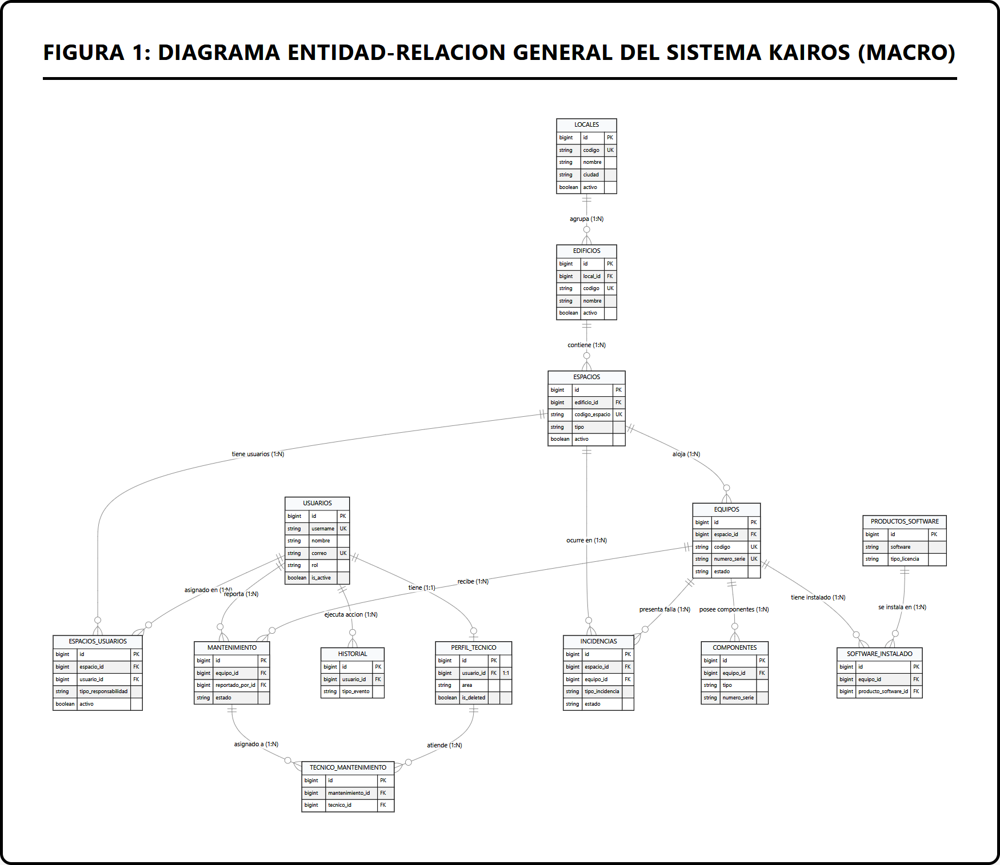
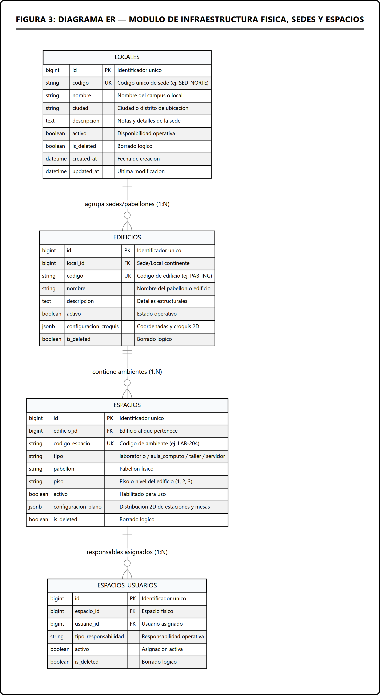
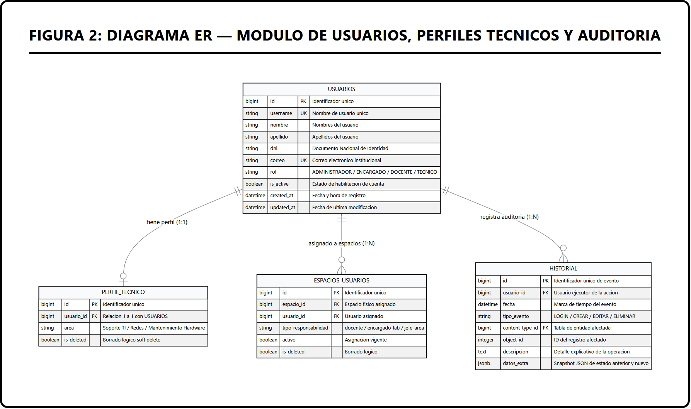
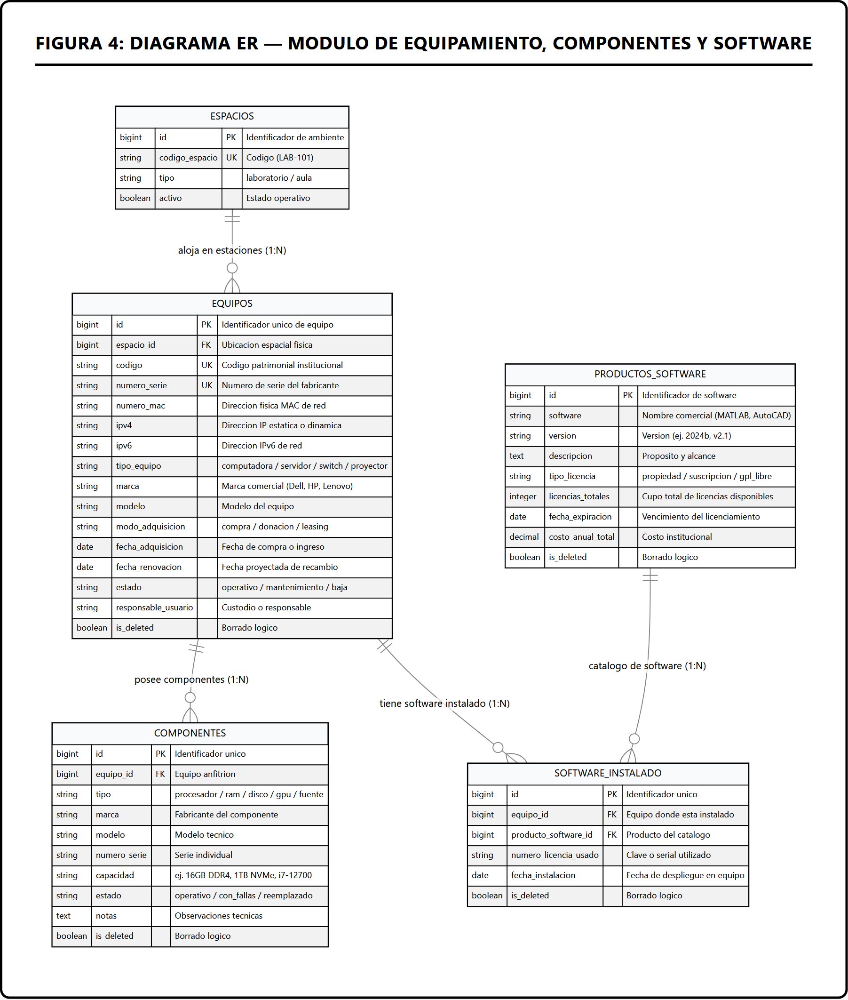
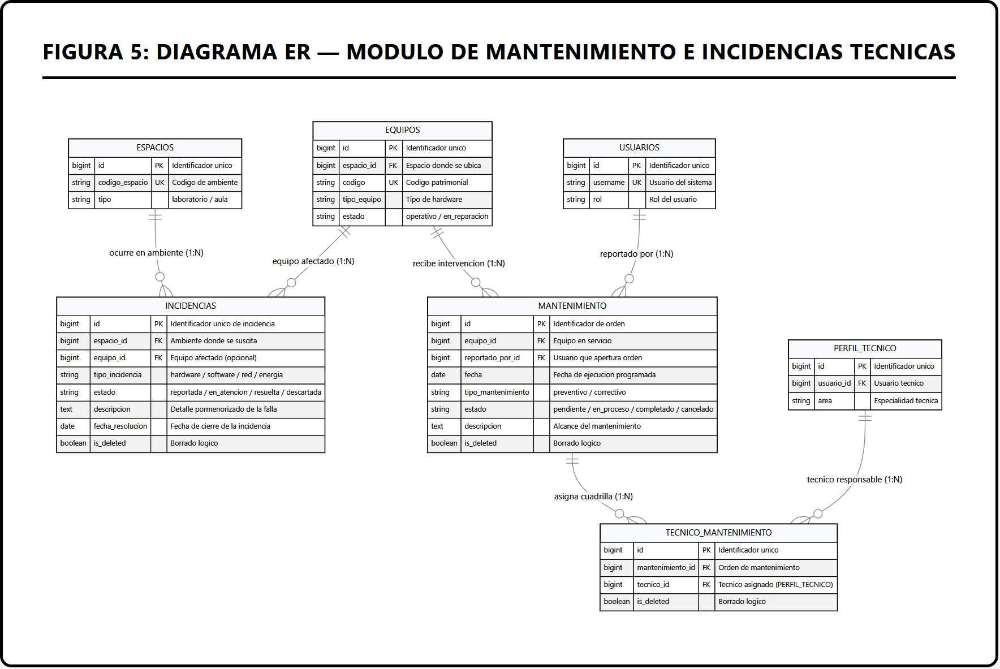

# Arquitectura y Esquema de Base de Datos — KairOs

El sistema utiliza **PostgreSQL** como motor relacional primario en entornos de desarrollo y producción, y **SQLite3** para la suite automatizada de pruebas unitarias y de integración.

---

## 1. Diagramas Entidad - Relación (Modelo Relacional KairOs)

A continuación se presentan los diagramas entidad-relación que modelan formalmente la persistencia de datos del sistema, estructurados tanto en su visión global (macro) como en diagramas modulares de detalle por dominio funcional.

### 1.1 Diagrama Entidad-Relación General (Macro)

El siguiente modelo consolidado ilustra las 14 entidades centrales del sistema y sus cardinalidades principales:

*Nota.* Elaboración propia (2026). Modelo Entidad-Relación integral de la base de datos de KairOs desplegado sobre PostgreSQL.

---

### 1.2 Módulo de Infraestructura Física, Sedes y Espacios

Modela la jerarquía geográfica y física del campus universitario o instituto, desde los locales hasta las estaciones de cómputo:

*Nota.* Elaboración propia (2026). Jerarquía espacial compuesta por `LOCALES` (sedes), `EDIFICIOS` (pabellones con croquis 2D), `ESPACIOS` (laboratorios y aulas con distribución de planos en JSON) y `ESPACIOS_USUARIOS` (asignación de responsabilidades de custodia).

---

### 1.3 Módulo de Usuarios, Perfiles Técnicos y Auditoría

Gestiona las cuentas de usuario, roles del sistema, especialidades técnicas y la pista inmutable de auditoría forense:

*Nota.* Elaboración propia (2026). Arquitectura de control de acceso basada en roles (RBAC) con extensión 1:1 para perfiles técnicos y registro transversal de auditoría con Generic Foreign Keys.

---

### 1.4 Módulo de Equipamiento, Componentes y Catálogo de Software

Control patrimonial detallado de hardware, componentes intercambiables y licenciamiento de software:

*Nota.* Elaboración propia (2026). Modelo relacional para trazabilidad de hardware por número de serie, MAC/IP, subcomponentes individuales y licencias de software asignadas.

---

### 1.5 Módulo de Mantenimiento e Incidencias Técnicas

Flujo operativo para reporte de fallas, apertura de órdenes preventivas/correctivas y asignación de cuadrillas técnicas:

*Nota.* Elaboración propia (2026). Flujo de resolución de tickets de incidencias y gestión de órdenes de trabajo con asignación de técnicos especializados.

---

## 2. Mecanismos Transversales de Persistencia

### 2.1 Borrado Lógico (*Soft Delete*)
Todos los modelos operativos (excepto `historial` que es inmutable y `usuarios` que utiliza la bandera `is_active`) heredan de la clase base `shared.models.BaseModel`.
- En lugar de ejecutar una instrucción `DELETE` destructiva en la base de datos, el método de borrado marca el atributo `is_deleted = True` y registra el usuario ejecutor en `updated_by`.
- Los QuerySets por defecto en servicios y repositorios excluyen automáticamente los registros eliminados mediante filtros globales (`.filter(is_deleted=False)`).

### 2.2 Auditoría Automática de Cambios
`BaseModel` implementa marcas de tiempo y auditoría de autoría de forma transparente:
- `created_at`: Marca temporal `DateTimeField(auto_now_add=True)`.
- `updated_at`: Marca temporal `DateTimeField(auto_now=True)`.
- `created_by`: Clave foránea opcional referenciando a `Usuario`.
- `updated_by`: Clave foránea opcional referenciando a `Usuario`.

### 2.3 Registro Inmutable de Auditoría Forense (`historial`)
Mediante el subsistema `django.contrib.contenttypes`, la tabla `historial` enlaza registros de cualquier tabla sin crear acoplamiento rígido de claves foráneas:
- `content_type`: Identificador de la tabla o entidad objetivo.
- `object_id`: Clave primaria del objeto afectado por la operación.
- `datos_extra`: Campo `JSONField` que almacena un snapshot con los valores anteriores y posteriores para posibilitar auditoría forense completa.
