# Manual de Usuario Oficial del Sistema KairOs

**Campus Tecnológico & Gestión de Infraestructura de Laboratorios**  
Versión: 1.0 | Fecha de Actualización: Septiembre 2026  
Estado: Sistema Operativo y Validado

---

## 📑 Tabla de Contenidos

1. [Introducción y Arquitectura Operativa](#1-introducción-y-arquitectura-operativa)
2. [Mecanismo de Actualización Automatizada de Capturas](#2-mecanismo-de-actualización-automatizada-de-capturas)
3. [Módulo 1: Acceso al Sistema y Autenticación](#3-módulo-1-acceso-al-sistema-y-autenticación)
   - 3.1 [Inicio de Sesión (Login)](#31-inicio-de-sesión-login)
   - 3.2 [Recuperación de Contraseña](#32-recuperación-de-contraseña)
4. [Módulo 2: Panel de Control (Dashboard)](#4-módulo-2-panel-de-control-dashboard)
5. [Módulo 3: Gestión y Administración de Usuarios](#5-módulo-3-gestión-y-administración-de-usuarios)
   - 5.1 [Catálogo y Filtrado de Usuarios](#51-catálogo-y-filtrado-de-usuarios)
   - 5.2 [Formulario Paso a Paso para Nuevo Usuario](#52-formulario-paso-a-paso-para-nuevo-usuario)
6. [Módulo 4: Gestión de Espacios y Campus Tecnológico](#6-módulo-4-gestión-de-espacios-y-campus-tecnológico)
   - 6.1 [Listado General de Espacios](#61-listado-general-de-espacios)
   - 6.2 [Mapa de Infraestructura y Pabellones (`/espacios/mapa`)](#62-mapa-de-infraestructura-y-pabellones-espaciosmapa)
   - 6.3 [Plano Interactivo de Laboratorio (`/espacios/:id`)](#63-plano-interactivo-de-laboratorio-espaciosid)
   - 6.4 [Asignación de Usuarios y Docentes a Espacios](#64-asignación-de-usuarios-y-docentes-a-espacios)
7. [Módulo 5: Inventario de Equipamiento y Hardware](#7-módulo-5-inventario-de-equipamiento-y-hardware)
   - 7.1 [Inventario General de Equipos](#71-inventario-general-de-equipos)
   - 7.2 [Formulario Paso a Paso de Registro de Equipo](#72-formulario-paso-a-paso-de-registro-de-equipo)
   - 7.3 [Gestión de Componentes Internos de Hardware](#73-gestión-de-componentes-internos-de-hardware)
8. [Módulo 6: Software y Licenciamiento](#8-módulo-6-software-y-licenciamiento)
   - 8.1 [Catálogo Maestro de Software](#81-catálogo-maestro-de-software)
   - 8.2 [Instalaciones de Software por Equipo](#82-instalaciones-de-software-por-equipo)
9. [Módulo 7: Mesa de Mantenimiento y Soporte Técnico](#9-módulo-7-mesa-de-mantenimiento-y-soporte-técnico)
10. [Módulo 8: Reporte y Seguimiento de Incidencias](#10-módulo-8-reporte-y-seguimiento-de-incidencias)
11. [Módulo 9: Historial Inmutable y Auditoría](#11-módulo-9-historial-inmutable-y-auditoría)

---

## 1. Introducción y Arquitectura Operativa

**KairOs** es la solución institucional para supervisar laboratorios de cómputo, terminales, software institucional y servicios de mantenimiento. Cada pantalla del sistema ha sido diseñada bajo estrictos estándares de usabilidad, accesibilidad y retroalimentación visual inmediata.

El presente manual describe de manera didáctica y secuencial ("primero se coloca esto, luego se selecciona tal cosa y los campos se rellenan de tal forma") la interacción con cada uno de los apartados del sistema.

---

## 2. Mecanismo de Actualización Automatizada de Capturas

Para evitar que este manual quede obsoleto cuando una vista sea refactorizada (por ejemplo, ante rediseños de la ruta `/espacios/mapa` o mejoras en formularios), se incluye un script autónomo de captura y anotación:

```bash
# Ubicación del script generador
python scripts/generar_manual_capturas.py
```

### ¿Cómo funciona la sincronización?
1. El script levanta un navegador automatizado (Playwright Chromium) con sesión autenticada.
2. Navega secuencialmente por cada una de las 17 vistas y modales clave.
3. Localiza los elementos visuales del DOM y extrae sus coordenadas exactas en pantalla.
4. Mediante la librería Pillow (`PIL`), dibuja recuadros rojos `#EF4444` con badges circulares numerados (`1`, `2`, `3`...).
5. Guarda las imágenes en `docs/manual_usuario/capturas/`, manteniendo el manual 100% actualizado con el diseño en vivo.

---

## 3. Módulo 1: Acceso al Sistema y Autenticación

### 3.1 Inicio de Sesión (Login)

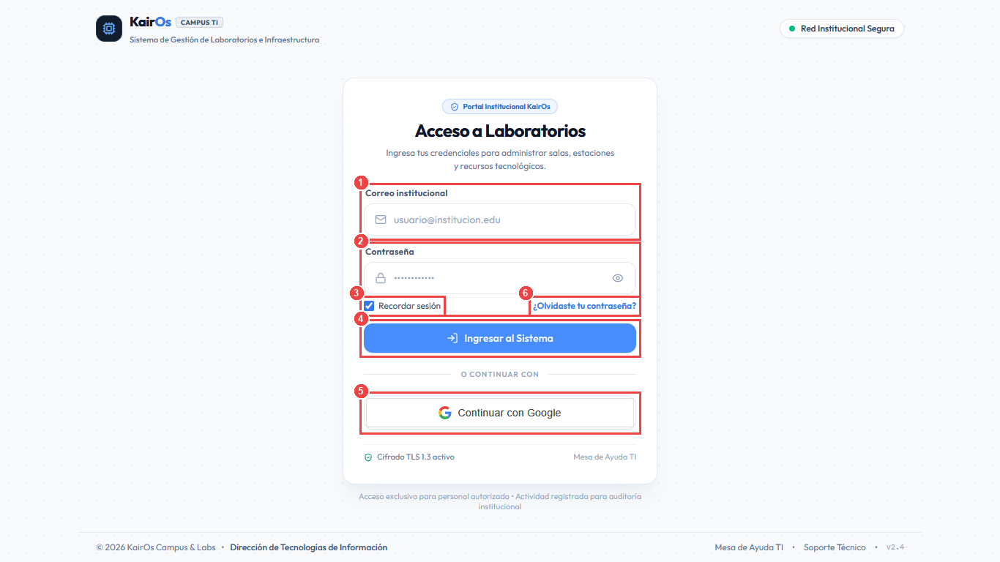

#### Secuencia Paso a Paso:
1. **[Paso 1] Correo institucional:** Ingrese su dirección de correo institucional registrada (ej. `admin@kairos.test` o `docente@institucion.edu.pe`).
2. **[Paso 2] Contraseña:** Introduzca su contraseña institucional asignada. Puede hacer clic en el icono del ojo lateral para revelar u ocultar los caracteres.
3. **[Paso 3] Recordar sesión:** Si se encuentra en un dispositivo confiable, marque la casilla para preservar el token seguro de sesión localmente.
4. **[Paso 4] Botón "Ingresar al Sistema":** Presione este botón principal para validar las credenciales. El sistema emitirá los tokens JWT y lo redirigirá al Panel de Control.
5. **[Paso 5] Continuar con Google (SSO):** Como alternativa de un solo clic, puede iniciar sesión federada mediante su cuenta de Google Workspace institucional.
6. **[Paso 6] ¿Olvidaste tu contraseña?:** Si extravió sus credenciales, presione este enlace para iniciar el procedimiento de recuperación por correo.

---

### 3.2 Recuperación de Contraseña

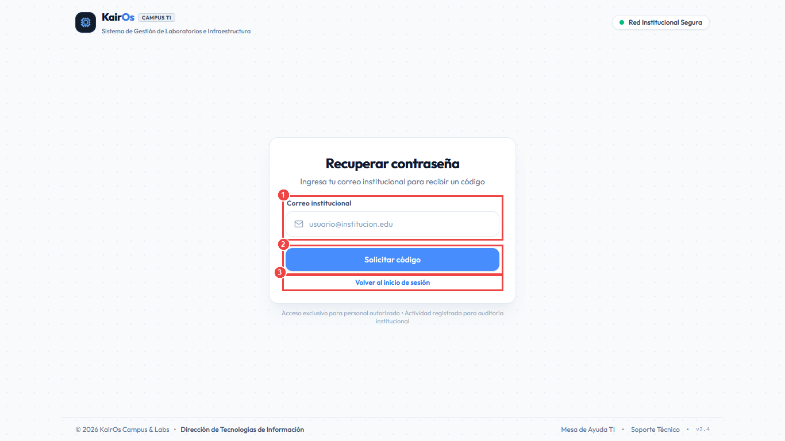

#### Secuencia Paso a Paso:
1. **[Paso 1] Correo de recuperación:** Escriba la dirección de correo con la que está dada de alta su cuenta de usuario.
2. **[Paso 2] Solicitar enlace:** Haga clic en el botón principal para remitir un token seguro temporal de restablecimiento.
3. **[Paso 3] Volver al inicio:** Si recordó sus credenciales, presione el enlace inferior para regresar al formulario de Login.

---

## 4. Módulo 2: Panel de Control (Dashboard)

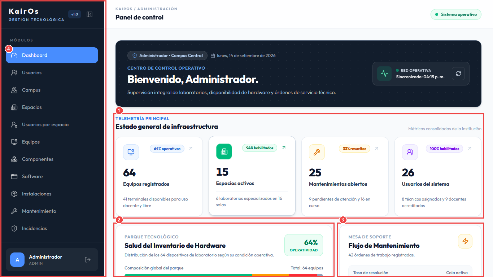

El Dashboard consolida la telemetría en tiempo real de todo el parque tecnológico del campus:

#### Componentes Clave:
1. **[Recuadro 1] Indicadores de Telemetría:**
   - **Equipos registrados:** Muestra el total de computadoras y dispositivos junto con el porcentaje de operatividad inmediata.
   - **Espacios activos:** Laboratorios, talleres y salas de cómputo habilitadas para docencia.
   - **Mantenimientos abiertos:** Número de órdenes de servicio en estado pendiente y en curso.
   - **Incidencias abiertas:** Reportes de fallas pendientes o en proceso que requieren triage.
   - **Usuarios del sistema:** Cuentas registradas clasificadas por técnicos y docentes activos.
2. **[Recuadro 2] Salud del Inventario de Hardware:** Gráfica interactiva de barras segmentadas que desglosa los dispositivos según su condición (En uso, En mantenimiento, Dañados o De baja).
3. **[Recuadro 3] Mesa de Soporte y Flujo de Trabajo:** Muestra la tasa de resolución porcentual, órdenes pendientes y tiempo promedio de atención técnica.
4. **[Recuadro 4] Barra Lateral de Módulos:** Menú colapsable con accesos directos a todos los submódulos.

---

## 5. Módulo 3: Gestión y Administración de Usuarios

### 5.1 Catálogo y Filtrado de Usuarios

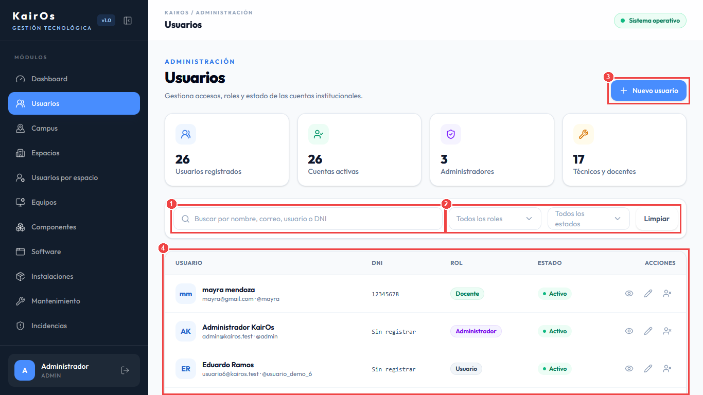

#### Secuencia de Operación:
1. **[Paso 1] Buscador Dinámico:** Escriba cualquier fragmento de nombre, apellido, correo institucional, nombre de usuario o DNI. La tabla filtrará en tiempo real sin recargar la página.
2. **[Paso 2] Filtros por Rol y Estado:**
   - Despliegue el selector de roles para aislar `Administrador`, `Técnico`, `Docente` o `Usuario`.
   - Despliegue el selector de estados para consultar cuentas activas o suspendidas.
   - Presione **Limpiar** para reiniciar los filtros.
3. **[Paso 3] Botón "+ Nuevo usuario":** Abre el modal flotante para dar de alta a un nuevo colaborador en la plataforma.
4. **[Paso 4] Grilla de Usuarios y Acciones:** Cada registro presenta botones para consultar detalle (ojo), editar datos (lápiz) y asignar laboratorios (icono usuario).

---

### 5.2 Formulario Paso a Paso para Nuevo Usuario

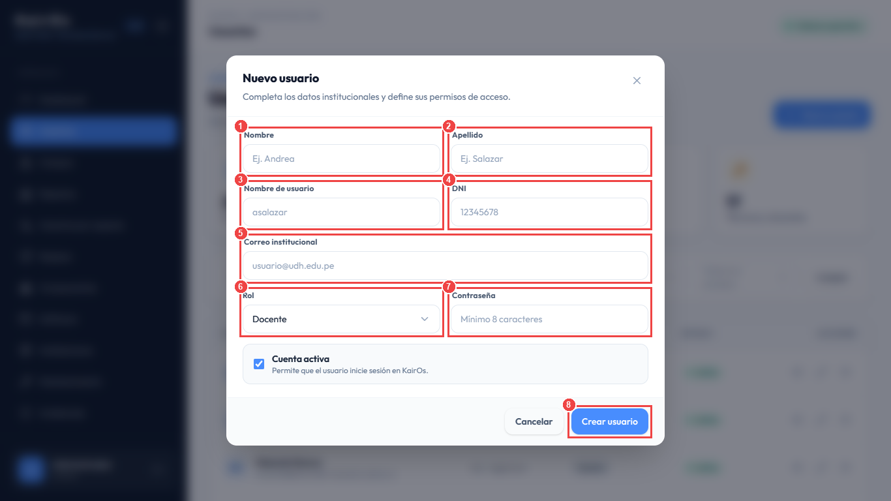

#### Cómo rellenar los campos obligatorios:
1. **[Paso 1] Nombre:** Escriba el nombre o nombres de pila (ej. `Carlos Andrés`).
2. **[Paso 2] Apellido:** Escriba los apellidos completos (ej. `Mendoza Salazar`).
3. **[Paso 3] Nombre de usuario:** Ingrese un identificador único en minúsculas (ej. `cmendoza`).
4. **[Paso 4] DNI:** Ingrese el Documento Nacional de Identidad de 8 dígitos numéricos.
5. **[Paso 5] Correo institucional:** Ingrese la cuenta de correo electrónico oficial que servirá como credencial de acceso.
6. **[Paso 6] Selector de Rol:** Seleccione el perfil operativo:
   - `Administrador`: Acceso total.
   - `Técnico`: Gestión de laboratorios, hardware y mantenimientos.
   - `Docente`: Reporte de incidencias y consulta de salas asignadas.
7. **[Paso 7] Contraseña inicial:** Escriba una contraseña segura de mínimo 8 caracteres con números y símbolos.
8. **[Paso 8] Botón "Crear usuario":** Haga clic para persistir el nuevo registro en la base de datos y generar el evento en el log de auditoría.

---

## 6. Módulo 4: Gestión de Espacios y Campus Tecnológico

### 6.1 Listado General de Espacios

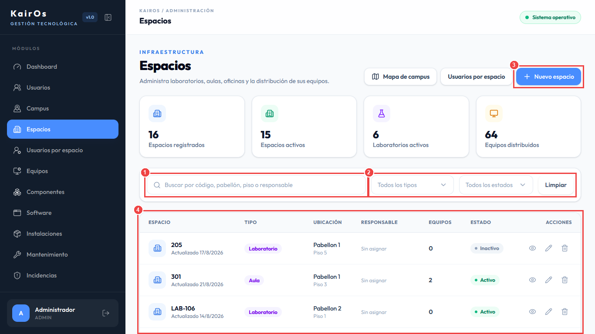

1. **[Paso 1] Búsqueda de Ambientes:** Localice salas mediante su código oficial (ej. `LAB 101`, `LAB-203`).
2. **[Paso 2] Filtros por Pabellón y Tipo:** Filtre por Pabellón 1 a 4 y clasifique por Laboratorio, Oficina, Aula o Sala de Cómputo.
3. **[Paso 3] "+ Nuevo espacio":** Permite crear un nuevo laboratorio asignándole edificio, piso y capacidad teórica.
4. **[Paso 4] Tabla de Ambientes:** Muestra la cantidad de terminales instaladas y un botón de acceso directo al plano interactivo de la sala.

---

### 6.2 Mapa de Infraestructura y Pabellones (`/espacios/mapa`)

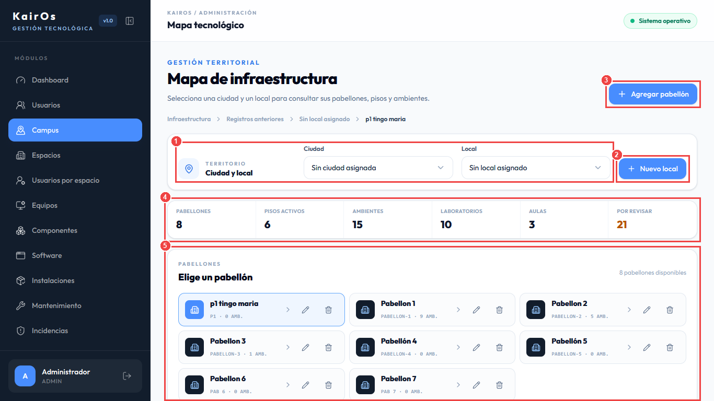

Este visualizador gráfico permite auditar la infraestructura distribuida en diferentes sedes y pabellones:
1. **[Paso 1] Selector Territorial (Ciudad y Local):** Seleccione la sede institucional para acotar los edificios a visualizar.
2. **[Paso 2] Botón "+ Nuevo local":** Registra una nueva sede o predio institucional.
3. **[Paso 3] Botón "+ Agregar pabellón":** Da de alta un nuevo bloque físico o edificio dentro del local actual.
4. **[Paso 4] Métricas Consolidadas:** Resume el número de pabellones, pisos activos, ambientes totales, laboratorios y salas pendientes de revisión.
5. **[Paso 5] Tarjetas de Pabellones:** Cada tarjeta muestra el código del edificio (ej. `Pabellon 1`) y cantidad de ambientes. Al hacer clic sobre un pabellón, se despliega el croquis interactivo de distribución por pisos.

---

### 6.3 Plano Interactivo de Laboratorio (`/espacios/:id`)

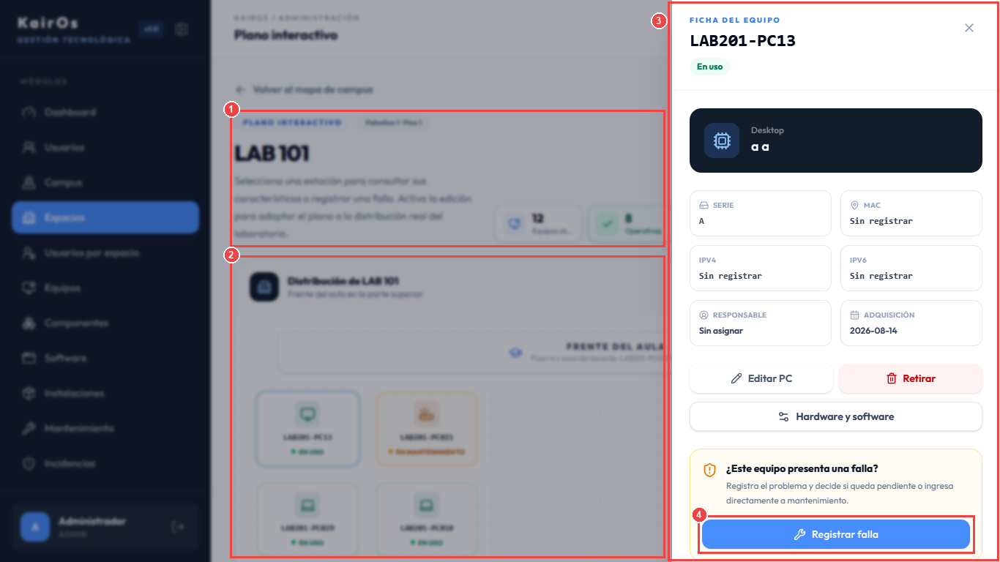

#### Cómo interactuar con los puestos de trabajo:
1. **[Paso 1] Encabezado del Laboratorio:** Visualiza el código (`LAB 101`), pabellón, piso, y tarjetas de resumen con equipos ubicados y estado operativo.
2. **[Paso 2] Cuadrícula Interactiva de Puestos:** Cada celda representa una computadora física en el laboratorio:
   - 🟢 **Verde:** Equipo en uso / 100% operativo.
   - 🟡 **Amarillo:** Equipo bajo mantenimiento técnico.
   - 🔴 **Rojo:** Equipo con falla o incidencia reportada.
3. **[Paso 3] Ficha Lateral del Equipo:** Al hacer clic en cualquier computadora de la cuadrícula, se despliega el panel lateral derecho con:
   - Código interno (ej. `LAB201-PC13`).
   - Número de serie y Dirección MAC.
   - Direcciones de red IPv4 / IPv6 asignadas.
   - Acceso a software instalado y herramientas técnicas de soporte.
4. **[Paso 4] Botón "Registrar falla":** Crea una incidencia pendiente sobre la terminal seleccionada sin salir del plano interactivo. Si el personal operativo elige atención inmediata, el sistema crea después un mantenimiento correctivo relacionado; el reporte y la orden siguen siendo registros separados.
5. **[Paso 5] Historial de la máquina:** La ficha muestra incidencias abiertas, mantenimientos en curso y el historial de intervenciones.


---

### 6.4 Asignación de Usuarios y Docentes a Espacios

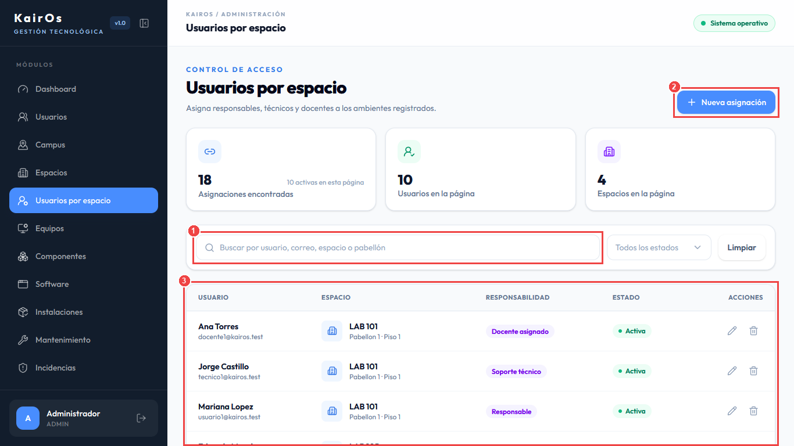

1. **[Paso 1] Selector de Laboratorio:** Escoja el espacio físico cuyas asignaciones desea inspeccionar.
2. **[Paso 2] Botón "+ Asignar usuario":** Despliega el diálogo para asociar un docente, técnico responsable o encargado de sala.
3. **[Paso 3] Tabla de Responsabilidades:** Detalla los usuarios acreditados, tipo de responsabilidad (`responsable`, `soporte técnico`, `docente asignado`) y opciones para desvincular la asignación.

---

## 7. Módulo 5: Inventario de Equipamiento y Hardware

### 7.1 Inventario General de Equipos

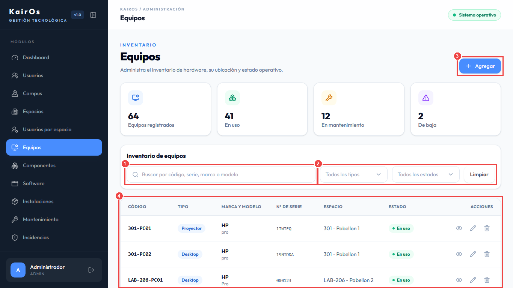

1. **[Paso 1] Barra de Búsqueda Rápida:** Filtre por código patrimonial, número de serie de fábrica, marca o modelo.
2. **[Paso 2] Filtros de Estado y Categoría:** Seleccione el tipo (`Desktop`, `Laptop`, `Servidor`, `Proyector`) y su condición (`En uso`, `En mantenimiento`, `Dañado`, `De baja`).
3. **[Paso 3] Botón "+ Registrar equipo":** Abre el formulario de alta de nuevo hardware.
4. **[Paso 4] Tabla de Inventario:** Lista de terminales con badges de estado, laboratorio donde reside y botones para editar o tramitar la baja patrimonial.

---

### 7.2 Formulario Paso a Paso de Registro de Equipo

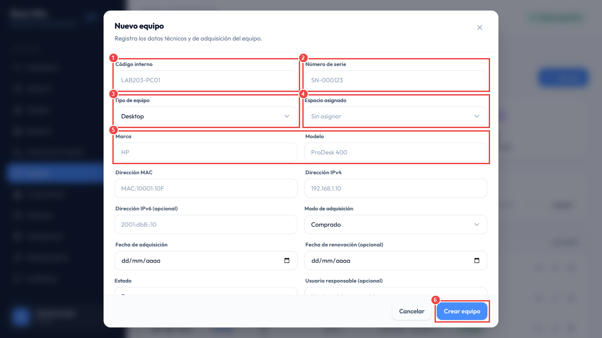

#### Secuencia de llenado:
1. **[Paso 1] Código interno:** Escriba el identificador institucional (ej. `LAB101-PC25`).
2. **[Paso 2] Número de serie:** Digite el número de serie alfanumérico provisto por el fabricante en el chasis.
3. **[Paso 3] Tipo de equipo:** Elija en el selector entre Desktop, Laptop, Servidor, Proyector o Impresora.
4. **[Paso 4] Espacio asignado:** Seleccione el laboratorio o aula donde se ubicará físicamente el equipo.
5. **[Paso 5] Marca y Modelo:** Indique la marca comercial (ej. `Dell`, `HP`, `Lenovo`) y el modelo específico (ej. `OptiPlex 3080`).
6. **[Paso 6] Botón "Crear equipo":** Confirma el registro y valida automáticamente que no exista duplicidad de número de serie ni dirección MAC.

---

### 7.3 Gestión de Componentes Internos de Hardware

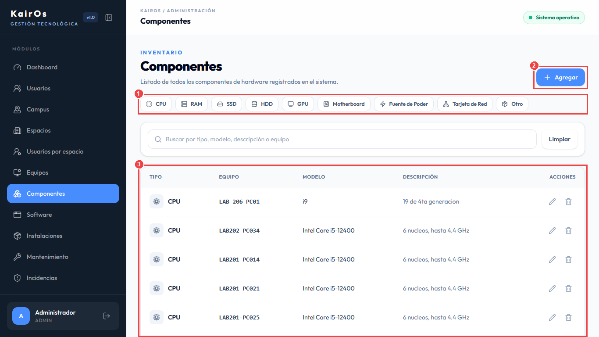

1. **[Paso 1] Filtro por Tipo de Componente:** Clasifique por CPU, Memoria RAM, Almacenamiento SSD/HDD o Tarjeta Gráfica (GPU).
2. **[Paso 2] Botón "+ Nuevo componente":** Permite anexar un nuevo componente a una computadora existente.
3. **[Paso 3] Tabla de Especificaciones:** Lista capacidades técnicas (ej. `32GB DDR5`, `1TB NVMe`), seriales individuales y condición operativa de cada pieza interna.

---

## 8. Módulo 6: Software y Licenciamiento

### 8.1 Catálogo Maestro de Software

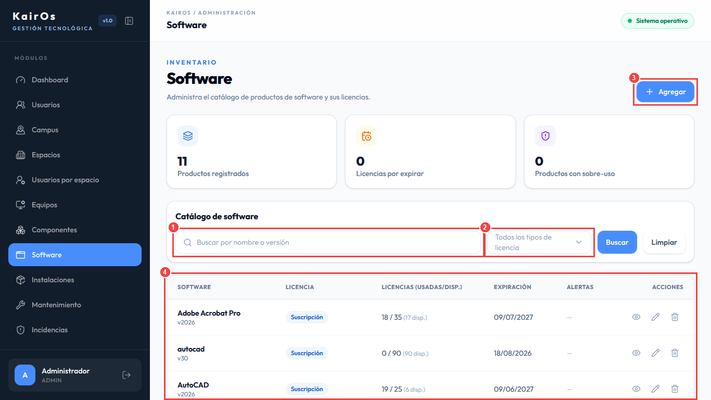

1. **[Paso 1] Buscador de Software:** Ingrese el nombre de la aplicación (ej. `MATLAB`, `AutoCAD`, `Visual Studio`).
2. **[Paso 2] Filtro por Tipo de Licencia:** Clasifique por licencias Perpetuas, de Suscripción, OEM, de Volumen o de Código Abierto.
3. **[Paso 3] Botón "+ Registrar software":** Da de alta un nuevo producto indicando licencias contratadas y fecha de vencimiento.
4. **[Paso 4] Tarjetas de Productos:** Exhibe el total de licencias, cuántas se encuentran actualmente instaladas, cuántas quedan disponibles y si existe alerta por expiración próxima.

---

### 8.2 Instalaciones de Software por Equipo

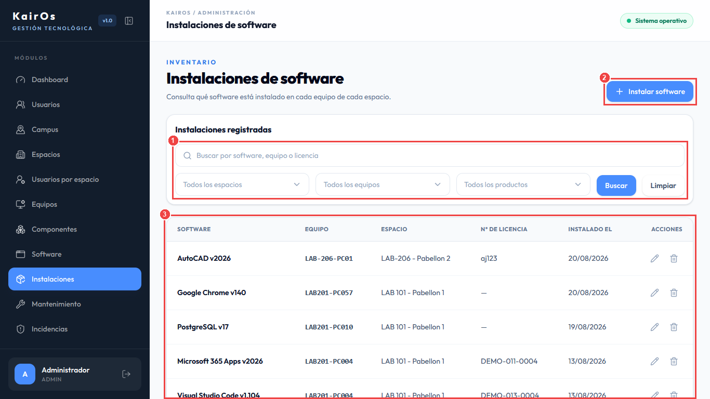

1. **[Paso 1] Filtro Combinado:** Localice instalaciones específicas filtrando por producto de software o por código de computadora.
2. **[Paso 2] Botón "+ Registrar instalación":** Asocia una licencia del catálogo a un equipo de cómputo específico.
3. **[Paso 3] Listado de Terminales con Software:** Muestra la fecha de instalación, clave de activación utilizada y botón para desinstalar o reasignar la licencia.

---

## 9. Módulo 7: Mesa de Mantenimiento y Soporte Técnico

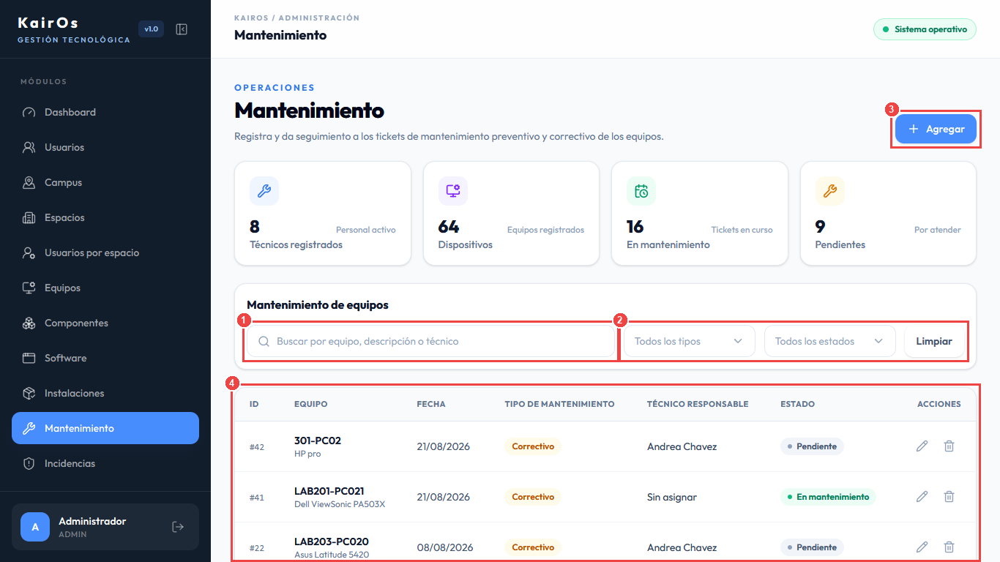

#### Flujo de Atención de Mantenimientos:
1. **[Paso 1] Buscador de Tickets:** Localice órdenes por código de equipo afectado, técnico asignado o palabras clave del diagnóstico.
2. **[Paso 2] Filtro por Tipo y Estado:** Conmute entre mantenimiento **Preventivo** (limpieza periódica, calibración) y **Correctivo** (reparación de averías). Filtre por tickets `Pendientes`, `En atención`, `Finalizados` o `Cancelados`.
3. **[Paso 3] Botón "+ Agregar orden":** Abre el formulario para registrar un ticket, seleccionando el equipo, el tipo y, si es correctivo, la incidencia de origen.
4. **[Paso 4] Iniciar atención:** En una orden pendiente pulse **Iniciar atención** cuando el técnico comience a trabajar.
5. **[Paso 5] Finalizar mantenimiento:** Pulse **Finalizar mantenimiento** en una orden en atención. Registre diagnóstico, trabajo realizado, confirme la prueba de funcionamiento y seleccione el resultado (`Funcional / en uso`, `Dañado` o `De baja`).
6. **[Paso 6] Resultado:** Si el correctivo deja el equipo funcional, KairOs cierra automáticamente la incidencia relacionada. Si queda dañado, la incidencia permanece abierta y muestra **Crear otra intervención**.

---

## 10. Módulo 8: Reporte y Seguimiento de Incidencias

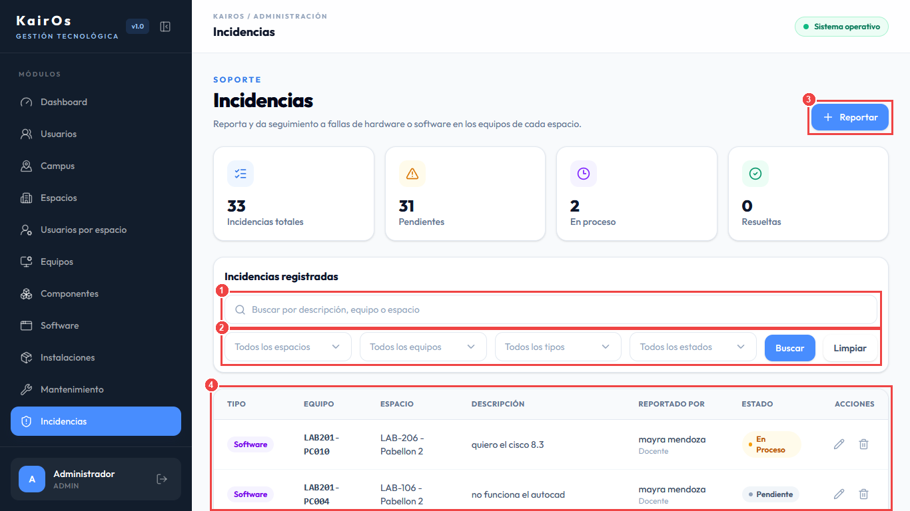

1. **[Paso 1] Buscador de Incidencias:** Encuentre reportes por descripción, equipo, espacio o técnico asignado.
2. **[Paso 2] Filtros Multicriterio:** Clasifique por prioridad (`Baja`, `Media`, `Alta`, `Crítica`), naturaleza (`Hardware`/`Software`) y estado (`Pendiente`, `En proceso`, `Resuelto`, `Cerrado`, `Cancelado`, `Duplicado`).
3. **[Paso 3] Botón "+ Reportar":** Docentes y usuarios registran la falla sin elegir estado; el reporte inicia en `Pendiente`.
4. **[Paso 4] Panel de triage:** El personal operativo pulsa **Atender incidencia**, asigna técnico y puede crear un mantenimiento correctivo relacionado.
5. **[Paso 5] Progreso:** El detalle muestra Reportada, En atención, Mantenimiento, Equipo verificado y Cerrada, además de las órdenes relacionadas.
6. **[Paso 6] Resultado:** Un correctivo funcional cierra la incidencia automáticamente. Si el equipo queda dañado, el reporte permanece abierto para crear otra orden; si el problema reaparece después del cierre, se registra una nueva incidencia.

---

## 11. Módulo 9: Historial Inmutable y Auditoría

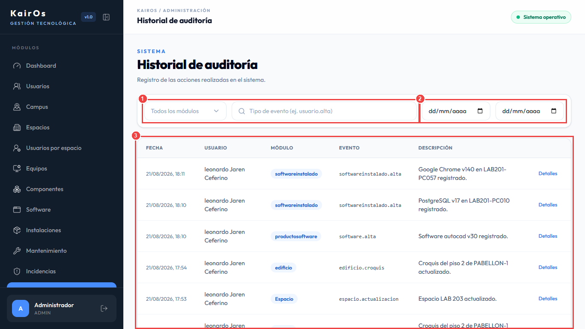

1. **[Paso 1] Filtro por Módulo y Evento:** Seleccione el dominio de interés (`equipo`, `mantenimiento`, `espacio`, `usuario`, `softwareinstalado`) o especifique el clasificador exacto (ej. `equipo.alta`).
2. **[Paso 2] Selector de Rango de Fechas:** Acote la consulta indicando fecha de inicio (`dd/mm/aaaa`) y fecha final.
3. **[Paso 3] Trazabilidad Inmutable:** Cada fila contiene la estampa de tiempo exacta, el usuario autor de la modificación, el módulo afectado y un botón de **Detalles** para inspeccionar los valores anteriores y nuevos en formato JSON.
